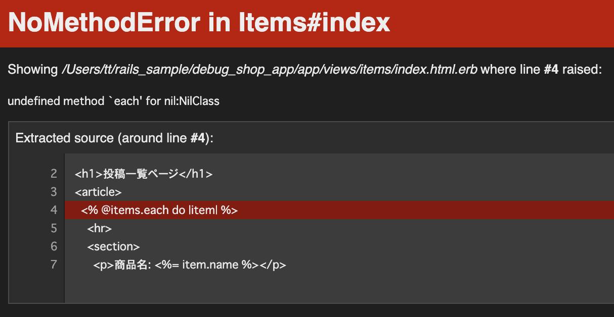
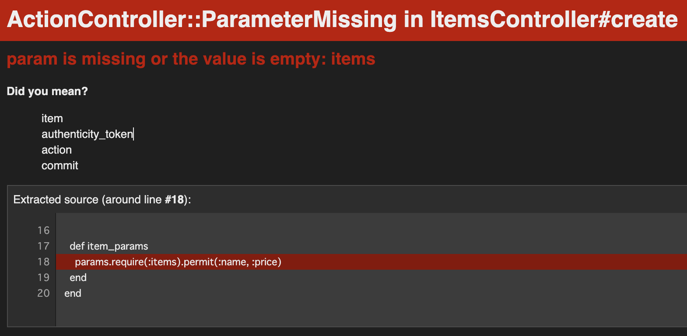
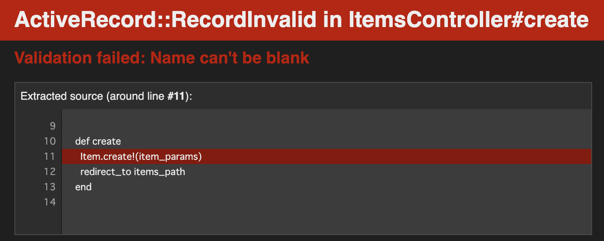

# Rails 課題3 デバッグ練習アプリ

### 開発環境構築(Ruby)

- Ruby 2.7.3 をインストールされていない場合は，以下を参考にして下さい。

https://www.yanbaru-code.com/questions/39

## 準備

このリポジトリの右上にある「Fork」ボタンをクリックし，各自のリポジトリに「フォーク」して下さい

フォーク後の リポジトリURL をコピーしておき，ターミナルから以下を実行して下さい。

```
cd ~/rails
git clone リポジトリURL
cd debug_shop_app
git switch -c feature/debug
bundle install
rails db:create
rails db:migrate
rails db:seed
rails s
```

[http://localhost:3000/](http://localhost:3000/) にアクセスし，`Yay! You’re on Rails!` が表示されれば初期動作確認はOKです。

## 課題

商品を投稿・一覧表示できるアプリに，「3箇所」意図的にバグを仕込んでいます。デバッグツールを使いつつ，全てのエラーを解消して下さい。

- 一覧ページでエラー
- 新規投稿時にエラー





【補足】 URL が分からない場合は `rails routes` で確認しましょう!

エラーの解消ができましたら， `feature/debug` ブランチをプッシュしてプルリクを出し，（マージはせずに！）レビュー依頼を行って下さい。

レビュー依頼の際は，プルリクのURLを貼るようにして下さい。

### 注意

- マイグレーションファイル・テーブルは変更しないで下さい。
  - `db/migrate/20210422231207_create_items.rb` が正しい前提でエラーを解消して下さい

## ヒント

- 一覧ページのURLは `rails routes` コマンドで探して下さい。
- `pry-byebug` を導入し，デバッグツールを使いながら解消してみましょう。

```rb
group :development, :test do
  # Call 'byebug' anywhere in the code to stop execution and get a debugger console
  gem 'byebug', platforms: [:mri, :mingw, :x64_mingw]
  # ***** 以下を追加 *****
  gem 'pry-byebug'
  # ***** 以上を追加 *****
end
```

```zsh
bundle install
```

- エラーがどうしても解消できない方は，以下のファイルに簡単なヒントを記載しております。

[「ヒント」はこちらをクリック!](./hint.md)
